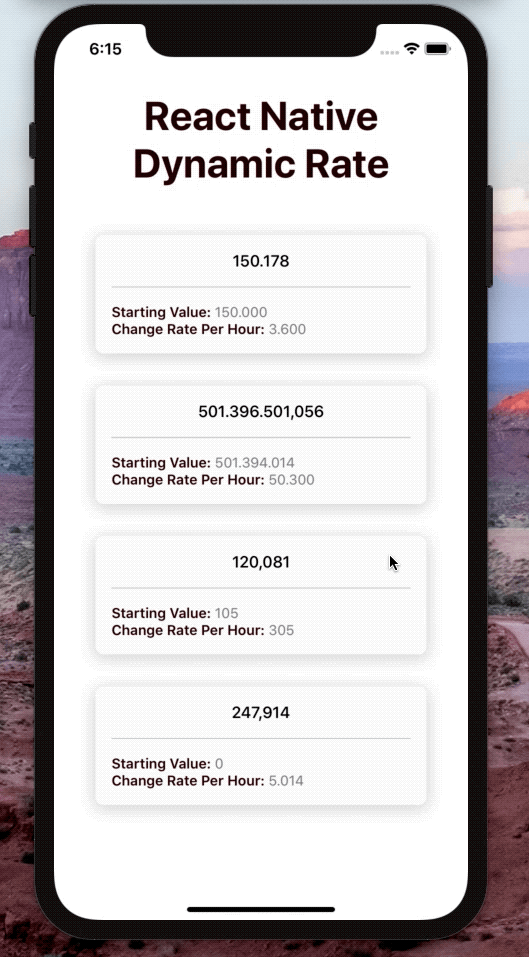

[](https://github.com/WrathChaos/react-native-dynamic-rate)

[](https://www.npmjs.com/package/react-native-dynamic-rate)
[](https://www.npmjs.com/package/react-native-dynamic-rate)

[](https://opensource.org/licenses/MIT)
[](https://github.com/prettier/prettier)


<p align="center">
  
</p>

# Installation

Add the dependency:

```ruby
npm i react-native-dynamic-rate
```

## Peer Dependencies

###### IMPORTANT! You need install them

```js
"react": ">= 16.x.x",
"react-native": ">= 0.55.x",
```

# Usage

## Import

```js
import DynamicRate from "react-native-dynamic-rate";
```

## Basic Usage

Rate is depends on the hour you need to calculate your rate depends on the **/per hour**
3600 rate is 1 plus per second.

```js
<DynamicRate initialValue={150000} rate={3600} />
```

# Configuration - Props

| Property                |   Type    | Default | Description                                                                             |
| ----------------------- | :-------: | :-----: | --------------------------------------------------------------------------------------- |
| rate                    |  number   | default | set the increase rate                                                                   |
| initialValue            |  number   | default | set the initial value                                                                   |
| numberFormat            |  string   | "tr-TR" | you can set your own language/region's number format                                    |
| customNumberFormat      | function  | default | if you do not want to use the default number format, you can set it your own            |
| disableNumberFormatting |  boolean  |  false  | if you do not want any number formatting, you can simply disable it                     |
| disableNumberFormatting |  boolean  |  false  | if you do not want any number formatting, you can simply disable it                     |
| textStyle               |   style   | default | set your own text style instead of default one                                          |
| TextComponent           | component |  Text   | set your own custom Text component instead of the default react native's Text component |

## Author

FreakyCoder, kurayogun@gmail.com

## License

React Native Dynamic Rate is available under the MIT license. See the LICENSE file for more info.
